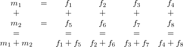
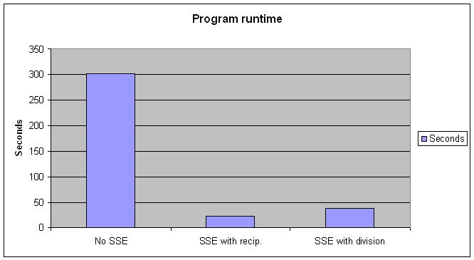
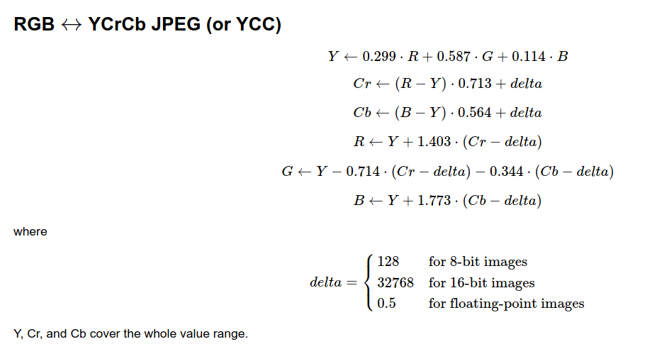
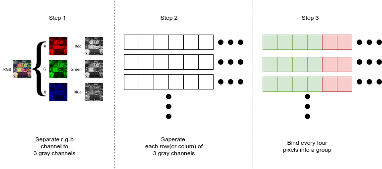
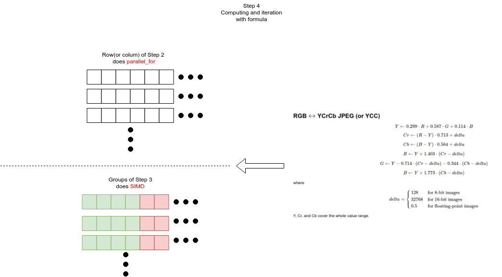

# Introduction to the SIMD and  how it applies to OpenCV(RGB->YCrCb)

## Introduction to the SIMD

### Definition of the SIMD

The Single Instruction Multiple Data (SIMD), as the name suggests,

to exectute repeatedly opearation of airthmetic requires only one instruction cycle in CPU.

This is a class of parallel computing.

These are common SIMDs: [[1]](https://en.wikipedia.org/wiki/SIMD)

name  | hardware-platform       |
------|-------------------------|
neon  | ARM                     |
SSE   | x86 or x86_64           |
opencl| cross-hardware-platform |

These are all supported by OpenCV.

OpenCV defaults to opencl and has a high priority.

### Introduction to architecture of SIMD(SSE)

I use SSE as an example to explain how SIMD works.[[2]](http://sci.tuomastonteri.fi/programming/sse)

One instruction of SSE can operate 4 x 32 bits airthmetic at one instruction cycle.

So before operate, user must move 4 datas(32 bits) to specific register.

The "4 dates" is defined as "vector" as follows:

vector name             |    usage
------------------------|-----------------------------------------|
vec2,vec3,vec4          |    floating point vector                |
vec2b,vec3b,vec4b       |    mask type for floating point vector  |
ivec2,ivec3,ivec4       |    signed integer vector                |
ivec2b,ivec3b,ivec4b    |    mask type for signed integer vector  |
mat4x2,mat4x3,mat4x4    |    4 column floating point matrix (SSE) |

For instance, We add 2 of 1x4 vector (`m1`+`m2`),

(set of `m1 = {f1,f2,f3,f4}`; set of `m2 = {f5,f6,f7,f8}`)

Operation like:

Above operation only need to 1 instruction cycle.

If you do not use SIMD, you need to consume > 4 instruction cycles.

* cycle.1: m[1] <- f1+f5
* cycle.2: m[2] <- f2+f6
* cycle.3: m[3] <- f3+f7
* cycle.4: m[4] <- f4+f8

If you want to use SSE for others variant size of array,

just split the array into 4xN subarrays,

and load these subarrays into SSE register N times.

### Performance

I refer to [[3]](http://supercomputingblog.com/optimization/getting-started-with-sse-programming/).

This test which calculates `Y = Sin(x) / x`, `for x = 1->64000`.

The following is a comparison of the time consumption of using SSE and not using SSE

We can see that the time consumption of the two is more than 10 times.

## SIMD in OpenCV (RGB->YCrCb)

### Formula of RGB to YCrCb (JPEG)

The formula of RGB to YCrCb (JPEG) in the OpenCV is [[4]](https://docs.opencv.org/3.2.0/de/d25/imgproc_color_conversions.html)

### Step of RGB to YCrCb in the OpenCV as follows

## Reference

[1] Explain SIMD by Wiki

(<https://en.wikipedia.org/wiki/SIMD>)

[2] A practical guide to SSE SIMD with C++

(<http://sci.tuomastonteri.fi/programming/sse>)

[3] The Supercomputing Blog: Getting started with SSE programming

(<http://supercomputingblog.com/optimization/getting-started-with-sse-programming/>)

[4] OpenCV official documentation: Color conversions - RGB->YCrCb

(<https://docs.opencv.org/3.2.0/de/d25/imgproc_color_conversions.html>)

[5] OpenCV source code: RGB->YCrCb

(<https://github.com/opencv/opencv/blob/master/modules/imgproc/src/color_yuv.cpp>)

[6] wikipedia : Grayscale

(<https://en.wikipedia.org/wiki/Grayscale>)